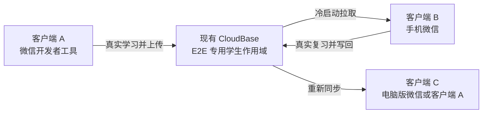

# 跨客户端云同步真写测试设计

## 1. 方案结论

使用现有 CloudBase 环境、现有正式集合和现有同步代码完成真写测试，不购买第二环境，也不引入测试集合映射。

所有写入严格限制在以下作用域：

- 教师：张张张123
- `teacher_id`：`oPLFQ1-8lLKRJVX7qukRc4ooeKgs`
- 学生：新建的 `E2E跨端同步专用` 学生
- 测试运行：每次生成唯一 `e2eRunId`

选择该方案的原因：

1. 用户已明确确认该教师账号及其学生均为测试数据。
2. 使用正式集合才能覆盖真实数据库权限、OPENID、云函数、文档 ID 和冲突合并逻辑。
3. 新建专用学生可避免修改 456 等已有测试历史，并便于按学生 ID 审计所有变化。
4. 不新增收费环境，也不需要修改生产集合结构。

## 2. 安全边界

### 2.1 写入前置检查

每次启用开发者工具云写前必须同时确认：

- 当前 OPENID 等于允许的测试教师 ID。
- 云端 `teachers` 中该 ID 的名称为“张张张123”。
- 当前学生 ID 为本次新建的 E2E 专用学生。
- 当前客户端不是正式版误触发的测试入口。
- 已记录其他学生的只读基线。

任一条件不满足时，不启用云写。

### 2.2 数据操作规则

- 不删除任何学生或历史记录。
- 不清空开发者工具或真机缓存。
- 不执行批量迁移、批量修复或全量补推。
- 不调用学生删除、记录删除、数据修复页面的写操作。
- 测试数据默认保留，便于第二客户端继续拉取和后续每日回归。

### 2.3 生产代码影响

第一阶段优先使用现有 `cloudWriteTest=1` 能力和专用测试学生，不修改业务同步代码。

只有在真实跨端测试发现确定缺陷时，才按独立变更重新评估、修复和回归；不得为了测试方便改写同步语义。

## 3. 客户端拓扑

客户端必须使用同一微信账号，保证 OPENID 一致。

## 4. 真实测试流程

### 阶段 A：建立专用学生

1. 在小程序正常学生管理流程中新建 `E2E跨端同步专用`。
2. 记录生成的学生 ID。
3. 只读查询云端 `students`，确认教师和学生作用域正确。

### 阶段 B：客户端 A 新学并上传

1. 开发者工具在完成身份和学生检查后启用 `cloudWriteTest=1`。
2. 使用指定词书完成 20 词判断、分组学习和最终测试。
3. 等待同步完成并核对 pending 队列。
4. 只读核对云端学习记录、掌握状态和进度。

### 阶段 C：手机真机拉取

1. 生成开发版预览二维码。
2. 同一微信账号在手机扫码进入。
3. 冷启动后选择 E2E 专用学生。
4. 核对首页、记录、统计、词书和本地明细。

### 阶段 D：手机写回

1. 在手机完成已到期抗遗忘复习；若未到精确时间，等待或建立一次性续测。
2. 核对手机本地状态和云端文档。
3. 记录手机型号、系统、微信版本和网络类型。

### 阶段 E：电脑反向拉取

1. 在电脑版微信或开发者工具冷启动。
2. 拉取手机写回数据。
3. 核对 `reviewCount`、时间线、最后/下次复习时间及防重复。

### 阶段 F：故障恢复

在 E2E 专用学生作用域内覆盖：

- 断网学习后恢复。
- 云写失败后的 pending 重试。
- 重复启动和快速刷新。
- 两端先后修改同一个词。
- 旧客户端状态不得覆盖更新的云端状态。

## 5. 数据核对

每个阶段同时比较：

- 客户端本地 `learningRecords`
- 客户端本地 `wordMastery`
- 客户端本地 `learningProgress`
- CloudBase `learning_records`
- CloudBase `word_mastery`
- CloudBase `learning_progress`
- CloudBase `preview_state`
- 首页、记录、统计、词书、复习页面

除 E2E 专用学生外，其他学生只读基线不得出现由本次测试产生的更新时间或文档数量变化。

## 6. 回滚

- 代码回滚点：`d1e0ce58aa46aa7500af4567faa42b53c1f1614f`
- 页面云写只读守卫已作为独立提交完成；业务同步语义缺陷本轮只定位、不修复。
- E2E 专用学生和记录默认保留；如以后需要删除，必须单独列出精确文档 ID 并再次确认。
